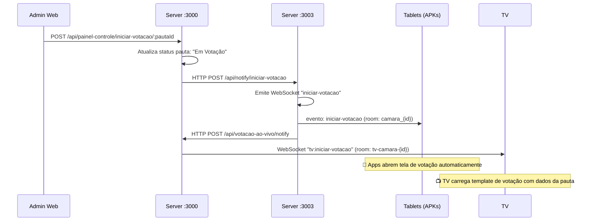
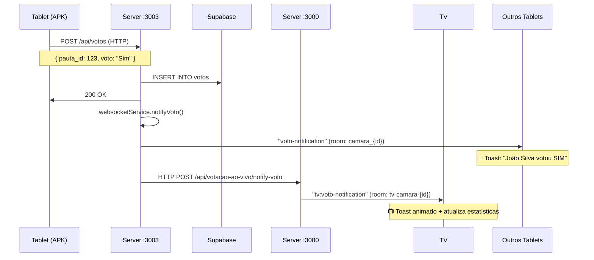
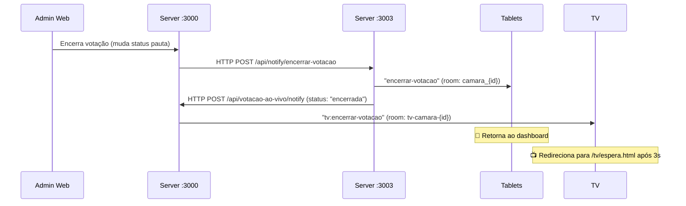

# 🏗️ Arquitetura LegislaNet

## 📊 Visão Geral Atualizada

O sistema foi arquitetado com **dois servidores independentes** que se comunicam via HTTP e WebSocket para fornecer uma experiência em tempo real para todos os tipos de usuários.

```
┌─────────────────────────────────────────────────────────────────┐
│                    🗄️ SUPABASE DATABASE                         │
│              (PostgreSQL + Auth + Storage)                      │
└────────────┬────────────────────────────┬──────────────────────┘
             │                            │
             │                            │
┌────────────▼─────────────┐   ┌─────────▼────────────────────────┐
│  🌐 BACKEND WEB :3000    │   │  📱 BACKEND TABLET :3003         │
│  (server-debug.js)       │◄──┤  (Apps/tablet_backend/server.js) │
│                          │───►│                                  │
│  Socket.IO + Express     │   │  Socket.IO + Express             │
│                          │   │                                  │
│  Usuários:               │   │  Usuários:                       │
│  • super_admin           │   │  • vereador (autenticado)        │
│  • admin_camara          │   │                                  │
│  • tv                    │   │  WebSocket Rooms:                │
│                          │   │  • camara_{id}                   │
│  WebSocket Rooms:        │   │  • pauta_{id}                    │
│  • tv-camara-{id}        │   │                                  │
│  • portal-camara-{id}    │   │  Funcionalidades:                │
│                          │   │  • Sistema de votação            │
│  Funcionalidades:        │   │  • Notificações em tempo real    │
│  • Gestão completa       │   │  • Estatísticas de pautas        │
│  • Painel de controle    │   │  • Gestão de votos               │
│  • Iniciar votações      │   │                                  │
│  • TVs em tempo real     │   │                                  │
└────────────┬─────────────┘   └──────────┬───────────────────────┘
             │                            │
    ┌────────▼────────┐          ┌────────▼────────┐
    │  💻 WEB ADMIN   │          │  📱 FLUTTER APP │
    │  (HTML/CSS/JS)  │          │  (Tablet)       │
    │  📺 TV DISPLAY  │          │                 │
    └─────────────────┘          └─────────────────┘
```

---

## 🔐 Roles e Acessos

| Role | Servidor | Interface | Permissões |
|------|----------|-----------|------------|
| `super_admin` | :3000 | Web Admin | Gestão global, todas as câmaras |
| `admin_camara` | :3000 | Web Admin | Gestão da câmara específica, iniciar votações |
| `tv` | :3000 | TV Display | Visualizar votações em tempo real da sua câmara |
| `vereador` | :3003 | Tablet App | Votar, ver pautas da sua câmara |

---

## 🌐 Backend Web (Porto 3000)

### **Arquivo**: `server-debug.js`

### **Responsabilidades**
- Gestão administrativa completa
- Autenticação de admins e usuários TV
- Painel de controle para iniciar votações
- WebSocket para TVs e portal público
- Coordenação entre servidores

### **WebSocket Rooms**
```javascript
// TVs autenticadas por câmara
tv-camara-{camaraId}      // Recebe eventos específicos para TVs

// Portal público (futuro)
portal-camara-{camaraId}  // Visualização pública de votações

// Salas genéricas
camara-{camaraId}         // Eventos gerais da câmara
```

### **Eventos WebSocket Específicos para TV**
```javascript
// Cliente → Servidor
socket.emit('tv:join-camara', { camaraId })    // Entrar na sala da câmara
socket.emit('tv:join-pauta', { pautaId })      // Entrar na sala da pauta

// Servidor → TV
socket.on('tv:iniciar-votacao', (data))        // Carrega tela de votação
socket.on('tv:voto-notification', (data))      // Notificação de voto
socket.on('tv:encerrar-votacao', (data))       // Encerra e volta para espera
```

### **APIs Principais**
```
GET  /health                                    # Health check
POST /api/painel-controle/iniciar-votacao/:id  # Inicia votação (admin_camara)
POST /api/painel-controle/iniciar-fala/:id     # Inicia fala de orador
POST /api/votacao-ao-vivo/notify               # Recebe notificações do :3003
POST /api/votacao-ao-vivo/notify-voto          # Recebe votos do :3003
GET  /api/votacao-ao-vivo/status/:camaraId     # Status atual (tv)
```

### **Comunicação Cross-Server**
O servidor :3000 **recebe** notificações HTTP do servidor :3003 e as retransmite via WebSocket para as TVs:

```javascript
// :3003 → :3000 (notificar início de votação)
POST http://localhost:3000/api/votacao-ao-vivo/notify
{
  camaraId, pautaId, pautaNome, pautaDescricao,
  sessaoNome, vereadoresOnline, status: "iniciada"
}

// :3003 → :3000 (notificar voto para TVs)
POST http://localhost:3000/api/votacao-ao-vivo/notify-voto
{
  pautaId, voto, vereadorNome, camaraId, isUpdate
}
```

---

## 📱 Backend Tablet (Porto 3003)

### **Arquivo**: `Apps/tablet_backend/server.js`

### **Responsabilidades**
- Autenticação exclusiva de vereadores (JWT + Supabase)
- Sistema de votação em tempo real
- WebSocket para tablets (Flutter)
- Notificações contextuais por câmara e pauta
- Logs detalhados com Winston

### **WebSocket Rooms**
```javascript
// Vereadores autenticados por câmara
camara_{camaraId}         // Todos os vereadores da câmara

// Visualização de pauta específica
pauta_{pautaId}           // Vereadores visualizando uma pauta
```

### **Eventos WebSocket**
```javascript
// Cliente → Servidor
socket.on('join-pauta', (pautaId))       // Entrar na sala da pauta
socket.on('leave-pauta', (pautaId))      // Sair da sala da pauta
socket.on('ping')                        // Manter conexão ativa

// Servidor → Cliente
socket.emit('connection-status', {})           // Status de conexão
socket.emit('iniciar-votacao', {})             # Abre tela de votação no app
socket.emit('voto-notification', {})           # Notificação de voto
socket.emit('pauta-stats-update', {})          # Estatísticas atualizadas
socket.emit('encerrar-votacao', {})            # Encerra votação
socket.emit('vereador-connected', {})          # Vereador conectou
socket.emit('vereador-disconnected', {})       # Vereador desconectou
```

### **APIs Principais**
```
POST /api/auth/login                           # Login de vereador
POST /api/auth/logout                          # Logout
GET  /api/vereador/profile                     # Perfil do vereador
GET  /api/vereador/camara                      # Vereadores da câmara
POST /api/votos                                # Registrar/atualizar voto
GET  /api/votos/pauta/:id                      # Votos de uma pauta
GET  /api/pautas                               # Pautas da câmara
GET  /health                                   # Health check

# Rotas de notificação (chamadas pelo :3000)
POST /api/notify/iniciar-votacao              # Recebe do :3000
POST /api/notify/encerrar-votacao             # Recebe do :3000
POST /api/notify/iniciar-fala                 # Recebe do :3000
```

### **Comunicação Cross-Server**
O servidor :3003 **envia** notificações HTTP para o servidor :3000:

```javascript
// :3003 → :3000 (notificar início de votação)
POST http://localhost:3000/api/votacao-ao-vivo/notify
{
  camaraId, pautaId, pautaNome, vereadoresOnline,
  status: "iniciada", timestamp
}

// :3003 → :3000 (notificar cada voto)
POST http://localhost:3000/api/votacao-ao-vivo/notify-voto
{
  pautaId, voto, vereadorNome, camaraId, isUpdate
}
```

---

## 🗳️ Fluxo Completo de Votação

### **1. Início da Votação**



**Payload enviado para TV (`tv:iniciar-votacao`):**
```javascript
{
  type: "iniciar-votacao",
  pauta: {
    id: 123,
    nome: "Projeto de Lei 001/2025",
    descricao: "Dispõe sobre..."
  },
  sessao: {
    nome: "Sessão Ordinária",
    tipo: "Ordinária",
    dataHora: "2025-01-13T10:00:00"
  },
  camaraId: 1,
  vereadoresOnline: 15,
  timestamp: "2025-01-13T10:00:00.000Z"
}
```

---

### **2. Vereador Vota**



**Payload do voto para TV (`tv:voto-notification`):**
```javascript
{
  type: "voto-tv",
  pautaId: 123,
  voto: "SIM",
  vereadorNome: "João Silva",
  isUpdate: false,
  timestamp: "2025-01-13T10:05:30.000Z"
}
```

**Notificação na TV:**
- Toast animado da direita para esquerda
- Cor de fundo baseada no voto (verde/vermelho/laranja)
- Duração: 4 segundos
- Atualização automática das estatísticas

---

### **3. Encerramento da Votação**



---

## 📺 Sistema de TV

### **Autenticação**
A TV se autentica como usuário com role `tv` vinculado a uma câmara específica:

```javascript
// 1. TV obtém token JWT via login
const token = localStorage.getItem('authToken');

// 2. Conecta ao servidor :3000 com autenticação
const socket = io('http://localhost:3000', {
  auth: { token }
});

// 3. Servidor valida:
// - Token válido
// - Role = "tv"
// - camara_id corresponde ao perfil da TV
```

### **Páginas da TV**
```
/tv/espera.html          # Tela de espera (quando não há votação)
/tv/votacao_tv.html      # Tela de votação em tempo real
```

### **Fluxo de Navegação da TV**

1. **Página de Espera** (`espera.html`)
   - Exibe logo da câmara
   - Aguarda evento `tv:iniciar-votacao`
   - Redireciona automaticamente para `votacao_tv.html?pauta={id}`

2. **Página de Votação** (`votacao_tv.html`)
   - Carrega dados da pauta
   - Conecta nas rooms: `tv-camara-{id}` e `tv-pauta-{id}`
   - Exibe estatísticas em tempo real
   - Mostra cards dos votantes
   - Recebe notificações de cada voto
   - Aguarda evento `tv:encerrar-votacao`
   - Redireciona para `espera.html`

### **Componentes da Tela de Votação**

```html
<!-- Layout em 2 colunas -->
<div class="tv-layout">
  <!-- Coluna 1: Informações e Estatísticas -->
  <div class="info-column">
    <div class="info-card">
      <h3>Pauta em Votação</h3>
      <div class="pauta-title">Nome da Pauta</div>
      <span class="badge-simbolica">Votação Simbólica</span>
    </div>

    <div class="info-card">
      <h3>Descrição da Pauta</h3>
      <p>Descrição completa...</p>
    </div>

    <div class="stats-card">
      <div class="vote-stats">
        <div class="stat-item favor">
          <span class="stat-number">15</span>
          <div class="stat-label">Favoráveis</div>
        </div>
        <div class="stat-item against">
          <span class="stat-number">3</span>
          <div class="stat-label">Contrários</div>
        </div>
        <div class="stat-item abstention">
          <span class="stat-number">2</span>
          <div class="stat-label">Abstenções</div>
        </div>
      </div>
      <div class="total-votes">
        <span class="number">20</span>
        <div class="label">Total de Votos</div>
      </div>
    </div>
  </div>

  <!-- Coluna 2: Cards dos Votantes -->
  <div class="votantes-column">
    <div class="votantes-grid">
      <!-- Cards dos vereadores que votaram -->
    </div>
  </div>
</div>
```

### **Notificações de Voto na TV**

```javascript
// Função para mostrar notificação visual de voto
function showVoteNotification(vereadorNome, voto, isUpdate) {
  // Cria toast animado no canto superior direito
  // Cor baseada no voto: verde (SIM), vermelho (NÃO), laranja (ABSTENÇÃO)
  // Animação: slideInFromRight (0.3s)
  // Duração: 4 segundos
  // Auto-remove com animação: slideOutToRight
}

// Listener de votos
socket.on('tv:voto-notification', (data) => {
  if (data.pautaId === pautaIdAtual) {
    // Mostra notificação
    showVoteNotification(data.vereadorNome, data.voto, data.isUpdate);

    // Atualiza estatísticas e cards
    setTimeout(() => fetchInitial(), 1000);
  }
});
```

---

## 🔒 Segurança

### **Autenticação**
- **JWT Tokens** via Supabase Auth
- **Sessão única** (invalidação de tokens antigos via `min_token_iat`)
- **Role-based access control** (RBAC)
- **Verificação de câmara** em todas as operações

### **Rate Limiting**
```javascript
// Backend Web (:3000)
// Rate limit padrão para rotas gerais

// Backend Tablet (:3003)
windowMs: 5 * 60 * 1000,  // 5 minutos
max: 2000,                 // 2000 requests por IP
```

### **CORS**
```javascript
// Backend Web (:3000)
origin: ['http://localhost:3000', 'http://127.0.0.1:3000']

// Backend Tablet (:3003)
origin: true  // Permite qualquer origem em dev
              // (localhost:* e 127.0.0.1:* são permitidos)
```

### **WebSocket Security**
- Autenticação JWT em cada conexão
- Validação de role e câmara
- Isolamento de rooms por câmara
- Verificação de pertencimento em cada operação

---

## 📊 Logs

### **Backend Web (:3000)**
```javascript
// Logger customizado no console
[SERVER] - timestamp - mensagem
[ROUTES] - timestamp - mensagem
[MIDDLEWARE] - timestamp - mensagem
```

### **Backend Tablet (:3003)**
```javascript
// Winston com rotação diária
logs/
  ├── tablet_backend_YYYY-MM-DD.log      # Logs gerais
  ├── tablet_errors_YYYY-MM-DD.log       # Erros
  └── tablet_auth_YYYY-MM-DD.log         # Autenticação

// Contextos de log
[TABLET_SERVER] - Servidor
[WEBSOCKET_SERVICE] - WebSocket
[TABLET_VOTO_CONTROLLER] - Votação
```

---

## 🚀 Desenvolvimento

### **Iniciar Backend Web**
```bash
# Na raiz do projeto
npm run dev
# ou
node server-debug.js

# Servidor em: http://localhost:3000
```

### **Iniciar Backend Tablet**
```bash
cd Apps/tablet_backend
npm run dev
# ou
node server.js

# Servidor em: http://localhost:3003
```

### **Iniciar Flutter App**
```bash
cd Apps/tablet_app
flutter run

# Configurar backend no app:
# WebSocket: http://localhost:3003
```

### **Testar TV**
```bash
# 1. Fazer login como usuário TV no web admin
# 2. Acessar: http://localhost:3000/tv/espera.html
# 3. Admin inicia votação no painel de controle
# 4. TV é redirecionada automaticamente para tela de votação
```

---

## 📡 Comunicação Entre Servidores

### **:3000 → :3003 (Iniciar Votação)**
```javascript
POST http://localhost:3003/api/notify/iniciar-votacao
Content-Type: application/json

{
  "camaraId": 1,
  "pautaId": 123,
  "pautaNome": "Projeto de Lei 001/2025",
  "pautaDescricao": "Dispõe sobre...",
  "sessaoNome": "Sessão Ordinária",
  "sessaoTipo": "Ordinária",
  "sessaoDataHora": "2025-01-13T10:00:00",
  "action": "iniciar-votacao"
}
```

### **:3003 → :3000 (Notificar Portal e TVs)**
```javascript
// Notificação de início/status
POST http://localhost:3000/api/votacao-ao-vivo/notify
Content-Type: application/json

{
  "camaraId": 1,
  "pautaId": 123,
  "pautaNome": "Projeto de Lei 001/2025",
  "pautaDescricao": "Dispõe sobre...",
  "sessaoNome": "Sessão Ordinária",
  "vereadoresOnline": 15,
  "status": "iniciada",  // ou "encerrada"
  "timestamp": "2025-01-13T10:00:00.000Z"
}

// Notificação de cada voto
POST http://localhost:3000/api/votacao-ao-vivo/notify-voto
Content-Type: application/json

{
  "pautaId": 123,
  "voto": "SIM",
  "vereadorNome": "João Silva",
  "camaraId": 1,
  "isUpdate": false
}
```

---

## 🎯 Vantagens desta Arquitetura

### **1. Separação de Responsabilidades**
- Backend Web: Gestão administrativa e coordenação
- Backend Tablet: Votação em tempo real isolada

### **2. Segurança Aprimorada**
- Cada servidor com suas próprias regras de autenticação
- Isolamento de dados por câmara em ambos os servidores
- Rate limiting específico por tipo de usuário

### **3. Escalabilidade Independente**
- Escalar servidor web sem afetar tablets
- Escalar servidor tablet para mais vereadores conectados
- Deploy independente de cada componente

### **4. Performance Otimizada**
- WebSocket dedicado para cada tipo de cliente
- Compressão desabilitada para velocidade
- Ping intervals otimizados (2s tablets, 10-15s TVs)

### **5. Manutenção Facilitada**
- Mudanças em votação não afetam admin
- Logs separados e específicos
- Debugging mais simples e direcionado

### **6. Resiliência**
- Se um servidor cair, o outro continua operacional
- Reconexão automática de clientes
- Fallback HTTP quando WebSocket falha

---

## 📈 Métricas de Performance

| Operação | Tempo | Detalhe |
|----------|-------|---------|
| **Autenticação JWT** | ~50ms | Validação token + query Supabase |
| **Inserção de Voto** | ~30ms | INSERT no PostgreSQL |
| **Notificação WebSocket** | ~5ms | Emissão para room |
| **Propagação Cross-Server** | ~10ms | HTTP request entre servidores |
| **Toast Animation TV** | ~200ms | Animação CSS hardware-accelerated |
| **Latência Total Voto→TV** | ~295ms | Quase tempo real! |

---

## 🔄 Fluxo de Dados Simplificado

```
Admin Web (:3000)
    ↓
[Iniciar Votação]
    ↓
Tablet Backend (:3003) ← HTTP
    ↓
WebSocket → Tablets (Flutter)
    ↓
[Tablets abrem tela de votação]
    ↓
Vereador vota → POST /api/votos (:3003)
    ↓
INSERT voto no Supabase
    ↓
WebSocket → Outros Tablets (notificação)
    |
    └→ HTTP → Backend Web (:3000)
          ↓
       WebSocket → TVs (notificação + estatísticas)
```

---

**✅ Sistema completamente funcional com comunicação cross-server eficiente e tempo real otimizado!**
