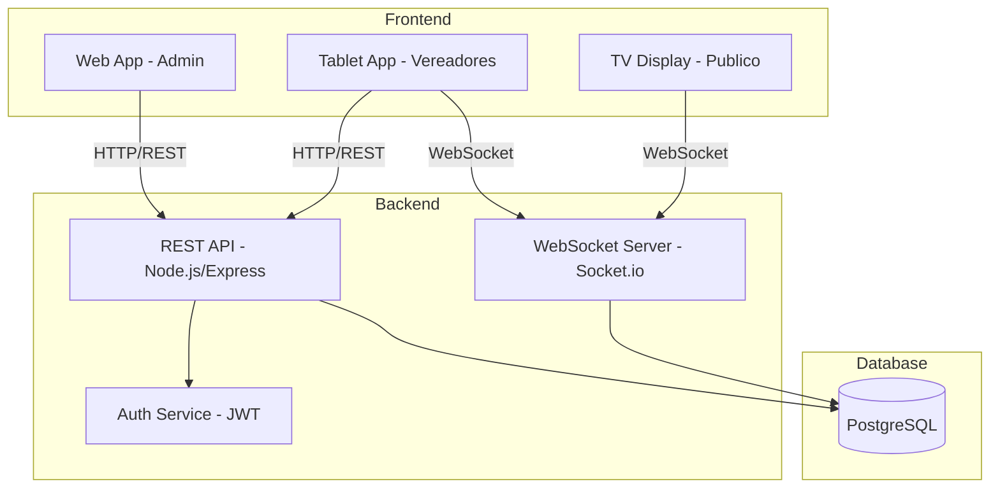

# LegislaNet

<div align="center">

**Sistema Integrado de Gestao e Votacao para Camaras Municipais**

[](https://nodejs.org/)
[](https://flutter.dev/)
[](https://www.postgresql.org/)
[](https://jestjs.io/)
[](LICENSE)

[](tests/)
[](tests/reports/)
[](.)

[Documentacao](#documentacao) •
[Instalacao](#instalacao) •
[Uso](#uso) •
[Testes](#testes) •
[Contribuindo](#contribuindo)

</div>

---

## Sobre o Projeto

O **LegislaNet** e uma solucao completa e moderna para digitalizacao e automacao dos processos legislativos de camaras municipais. O sistema oferece gerenciamento integrado de sessoes, pautas, votacoes em tempo real e transparencia publica dos processos democraticos.

### Principais Funcionalidades

- **Votacao Digital em Tempo Real** - Sistema de votacao nominal com sincronizacao instantanea via WebSocket
- **Painel Administrativo Web** - Gerenciamento completo de camaras, vereadores, partidos, sessoes e pautas
- **App Mobile para Vereadores** - Aplicativo Flutter para votacao em tablets com interface intuitiva
- **Exibicao Publica (TV)** - Display em tempo real dos resultados de votacao para transparencia
- **Autenticacao e Autorizacao JWT** - Sistema robusto de seguranca com niveis de acesso
- **Relatorios e Estatisticas** - Dashboards com metricas de participacao e resultados
- **159 Testes Automatizados** - Cobertura de 89% do codigo com Jest
- **Alta Performance** - WebSocket para comunicacao em tempo real

---

## Arquitetura do Sistema



### Tecnologias Utilizadas

#### Backend

- **Node.js 18.x** - Runtime JavaScript
- **Express 4.x** - Framework web
- **PostgreSQL 15** - Banco de dados relacional
- **Socket.io** - WebSocket para tempo real
- **JWT** - Autenticacao e autorizacao
- **Jest + Supertest** - Testes automatizados

#### Frontend Web

- **HTML5, CSS3, JavaScript** - Stack web moderno
- **Bootstrap 5** - Framework CSS responsivo
- **Socket.io Client** - Comunicacao em tempo real

#### App Mobile (Tablet)

- **Flutter 3.x** - Framework mobile multiplataforma
- **Dart** - Linguagem de programacao
- **Socket.io Client** - Sincronizacao em tempo real
- **Material Design 3** - Interface moderna

#### Infraestrutura

- **Git** - Controle de versao
- **npm** - Gerenciador de pacotes
- **Jest** - Framework de testes
- **dotenv** - Gerenciamento de variaveis de ambiente

---

## Estrutura do Projeto

```
LegislaNet/
├── Apps/
│   ├── tablet_app/              # Aplicativo Flutter para vereadores
│   │   ├── lib/
│   │   │   ├── services/        # Servicos (Auth, WebSocket, Toast)
│   │   │   ├── login_screen.dart
│   │   │   ├── dashboard_vereador_screen.dart
│   │   │   └── votacao_pauta_screen.dart
│   │   ├── pubspec.yaml
│   │   └── README.md
│   │
│   ├── tablet_backend/          # Backend especifico para tablet
│   │   ├── src/
│   │   │   ├── routes/
│   │   │   ├── controllers/
│   │   │   └── middlewares/
│   │   └── server.js
│   │
│   └── web_app/                 # Aplicacao web administrativa
│       ├── src/
│       │   ├── components/
│       │   ├── pages/
│       │   └── services/
│       └── index.html
│
├── Backend/                     # Backend principal (API REST)
│   ├── src/
│   │   ├── routes/             # Rotas da API
│   │   ├── controllers/        # Logica de negocio
│   │   ├── models/             # Modelos de dados
│   │   ├── middlewares/        # Middlewares (auth, CORS, etc)
│   │   ├── services/           # Servicos (WebSocket, Token)
│   │   └── config/             # Configuracoes
│   ├── server.js               # Servidor principal
│   └── package.json
│
├── tests/                       # Testes automatizados (159 testes)
│   ├── config/
│   │   └── testData.js         # Dados de teste
│   ├── helpers/
│   │   ├── auth.helper.js      # Helpers de autenticacao
│   │   ├── request.helper.js   # Helpers de requisicoes
│   │   └── tablet-request.helper.js
│   ├── integration/
│   │   ├── web/                # Testes web (104 testes)
│   │   │   ├── camaras.test.js
│   │   │   ├── vereadores.test.js
│   │   │   ├── partidos.test.js
│   │   │   ├── sessoes.test.js
│   │   │   ├── pautas.test.js
│   │   │   └── votos.test.js
│   │   └── tablet/             # Testes tablet (26 testes)
│   │       ├── pautas.test.js
│   │       ├── vereadores.test.js
│   │       └── votos.test.js
│   ├── unit/
│   │   └── auth/               # Testes unitarios (29 testes)
│   │       └── auth.test.js
│   └── reports/                # Relatorios de testes
│
├── supabase/                    # Configuracao Supabase (opcional)
├── jest.config.js              # Configuracao Jest
├── .env.example                # Exemplo de variaveis de ambiente
├── package.json                # Dependencias Node.js
└── README.md                   # Este arquivo
```

---

## Instalacao

### Pre-requisitos

Certifique-se de ter instalado:

- **Node.js 18.x ou superior** - [Download](https://nodejs.org/)
- **PostgreSQL 15 ou superior** - [Download](https://www.postgresql.org/download/)
- **Flutter 3.x** (para desenvolvimento mobile) - [Instalacao](https://docs.flutter.dev/get-started/install)
- **Git** - [Download](https://git-scm.com/downloads)

### Clonando o Repositorio

```bash
git clone https://github.com/seu-usuario/LegislaNet.git
cd LegislaNet
```

### Configuracao do Backend

1. **Instalar dependencias:**

```bash
cd Backend
npm install
```

2. **Configurar variaveis de ambiente:**

Crie um arquivo `.env` na raiz do projeto Backend:

```env
# Servidor
PORT=3000
NODE_ENV=development

# Banco de Dados
DB_HOST=localhost
DB_PORT=5432
DB_NAME=legislanet
DB_USER=seu_usuario
DB_PASSWORD=sua_senha

# JWT
JWT_SECRET=seu_secret_super_seguro_aqui
JWT_EXPIRES_IN=7d
JWT_REFRESH_SECRET=seu_refresh_secret_aqui
JWT_REFRESH_EXPIRES_IN=30d

# CORS
CORS_ORIGIN=http://localhost:8080

# WebSocket
WS_PORT=3001
```

3. **Criar e configurar banco de dados:**

```bash
# Acessar PostgreSQL
psql -U postgres

# Criar banco
CREATE DATABASE legislanet;

# Sair do psql
\q
```

**Importante:** Apos criar o banco, voce deve popular com a estrutura e dados. Veja a secao [Configuracao Inicial do Banco de Dados](#configuracao-inicial-do-banco-de-dados) para instrucoes detalhadas sobre como usar o `backup_completo.sql` (recomendado) ou configurar manualmente.

4. **Iniciar servidor:**

```bash
# Desenvolvimento
npm run dev

# Producao
npm start
```

O servidor estara disponivel em `http://localhost:3000`

### Configuracao do App Tablet

1. **Instalar dependencias Flutter:**

```bash
cd Apps/tablet_app
flutter pub get
```

2. **Configurar URL do backend:**

Edite `lib/services/auth_service.dart`:

```dart
static const String baseUrl = 'http://seu-ip-local:3000';
```

3. **Executar aplicativo:**

```bash
# Conectar tablet/emulador e executar
flutter run

# Ou para plataforma especifica
flutter run -d windows
flutter run -d android
flutter run -d ios
```

### Configuracao da Aplicacao Web

1. **Navegar para diretorio web:**

```bash
cd Apps/web_app
```

2. **Configurar URL da API:**

Edite `src/config/api.js`:

```javascript
const API_URL = "http://localhost:3000";
```

3. **Servir aplicacao:**

```bash
# Usando servidor HTTP simples
npx http-server -p 8080

# Ou usando Live Server (VS Code)
# Clique com botao direito em index.html > Open with Live Server
```

A aplicacao estara disponivel em `http://localhost:8080`

---

## Uso

### Configuracao Inicial do Banco de Dados

O sistema utiliza um banco de dados PostgreSQL que pode ser configurado de duas formas:

#### Opcao 1: Restaurar Backup Completo (Recomendado)

Para iniciar rapidamente com dados de exemplo e usuarios pre-configurados, utilize o arquivo `backup_completo.sql`:

```bash
# Restaurar o backup completo
psql -U postgres -d legislanet < Backend/database/backup_completo.sql
```

Este backup inclui:

- Estrutura completa do banco (tabelas, constraints, indices)
- Dados de exemplo (camaras, vereadores, partidos, sessoes)
- Usuarios pre-configurados para testes

#### Opcao 2: Configuracao Manual

Caso prefira configurar manualmente:

```bash
# Executar apenas a estrutura do banco
psql -U postgres -d legislanet < Backend/database/schema.sql

# Criar usuarios manualmente atraves da interface web ou API
```

### Usuarios de Teste (Incluidos no backup_completo.sql)

O arquivo `backup_completo.sql` ja inclui os seguintes usuarios para facilitar testes e desenvolvimento:

| Tipo         | Email/Login                 | Senha         | Permissoes                  |
| ------------ | --------------------------- | ------------- | --------------------------- |
| Super Admin  | `superadmin@legislanet.com` | `admin123`    | Acesso total ao sistema     |
| Admin Camara | `admin@camara.gov.br`       | `admin123`    | Gerenciar camara especifica |
| Vereador     | `vereador@camara.gov.br`    | `vereador123` | Votar em pautas             |
| TV           | `tv@camara.gov.br`          | `tv123`       | Visualizar votacoes         |

> **IMPORTANTE:** Estes usuarios sao apenas para ambiente de desenvolvimento/testes. Em producao, crie novos usuarios com senhas seguras e remova os usuarios de teste.

### Niveis de Acesso

1. **Super Admin** - Gerenciamento de todas as camaras

   - Criar/editar/deletar camaras
   - Gerenciar todos os usuarios
   - Acesso a relatorios globais

2. **Admin Camara** - Gerenciamento de uma camara especifica

   - Cadastrar vereadores e partidos
   - Criar sessoes e pautas
   - Gerenciar resultados de votacoes

3. **Vereador** - Participacao em votacoes

   - Visualizar pautas disponiveis
   - Registrar votos (Sim, Nao, Abstencao)
   - Ver historico pessoal

4. **TV** - Visualizacao publica
   - Exibir votacoes em tempo real
   - Mostrar resultados finais

### Fluxo de Votacao

1. **Admin cria sessao legislativa** no painel web
2. **Admin cadastra pautas** para votacao
3. **Admin inicia votacao** de uma pauta
4. **Vereadores recebem notificacao** no tablet via WebSocket
5. **Vereadores votam** pelo aplicativo (Sim/Nao/Abstencao)
6. **Votos sao sincronizados** em tempo real
7. **TV exibe resultados** instantaneamente
8. **Admin encerra votacao** e registra resultado final

### Modelo de Dados (Schema)

O sistema utiliza as seguintes entidades principais no PostgreSQL:

#### Tabelas Principais

**camaras**

- Armazena informacoes das Camaras Municipais
- Campos: id, nome, cnpj, cidade, estado, endereco, telefone, email
- Relacionamento: uma camara possui muitos vereadores

**vereadores**

- Cadastro dos vereadores de cada camara
- Campos: id, nome, email, senha_hash, camara_id, partido_id, foto_url
- Relacionamento: pertence a uma camara e um partido

**partidos**

- Cadastro de partidos politicos
- Campos: id, sigla, nome, numero
- Relacionamento: um partido possui muitos vereadores

**sessoes**

- Sessoes legislativas onde ocorrem as votacoes
- Campos: id, titulo, data, tipo, status, camara_id
- Status: "agendada", "em_andamento", "encerrada"
- Relacionamento: uma sessao possui multiplas pautas

**pautas**

- Pautas/projetos a serem votados
- Campos: id, titulo, descricao, sessao_id, status, resultado, ordem
- Status: "aguardando", "em_votacao", "encerrada"
- Resultado: "aprovada", "rejeitada", "empate"
- Relacionamento: uma pauta possui muitos votos

**votos**

- Registro individual de cada voto
- Campos: id, pauta_id, vereador_id, voto, timestamp
- Voto: "Sim", "Nao", "Abstencao"
- Constraint: um vereador pode votar apenas uma vez por pauta (UNIQUE)

**usuarios**

- Usuarios do sistema (admins, vereadores, TV)
- Campos: id, email, senha_hash, tipo, nome, camara_id
- Tipo: "super_admin", "admin_camara", "vereador", "tv"

---

## Testes

O projeto possui **159 testes automatizados** com **89% de cobertura**.

### Executar Todos os Testes

```bash
npm test
```

### Executar Testes por Categoria

```bash
# Testes de integracao web (104 testes)
npm run test:integration:web

# Testes de integracao tablet (26 testes)
npm run test:integration:tablet

# Testes unitarios (29 testes)
npm run test:unit

# Testes de autenticacao
npm run test:auth
```

### Executar com Cobertura

```bash
npm run test:coverage
```

Relatorio de cobertura disponivel em: `coverage/lcov-report/index.html`

### Executar Testes em Watch Mode

```bash
npm run test:watch
```

### Estrutura dos Testes

```
tests/
├── integration/
│   ├── web/
│   │   ├── camaras.test.js      # 23 testes - CRUD de camaras
│   │   ├── vereadores.test.js   # 19 testes - Gestao de vereadores
│   │   ├── partidos.test.js     # 17 testes - Partidos politicos
│   │   ├── sessoes.test.js      # 18 testes - Sessoes legislativas
│   │   ├── pautas.test.js       # 21 testes - Pautas de votacao
│   │   └── votos.test.js        # 6 testes  - Sistema de votos
│   └── tablet/
│       ├── pautas.test.js       # 8 testes  - Pautas (mobile)
│       ├── vereadores.test.js   # 5 testes  - Perfil vereador
│       └── votos.test.js        # 13 testes - Votacao mobile
└── unit/
    └── auth/
        └── auth.test.js         # 29 testes - Autenticacao JWT
```

### Analise de Codigo Dart

```bash
cd Apps/tablet_app
flutter analyze
```

**Resultado esperado:** 0 warnings, 0 errors

---

## Documentacao

### Documentacao Adicional

- [Descricao dos Commits](DESCRICAO_COMMITS_REPLICADOS.md) - Historico detalhado dos 10 commits principais
- [WebSocket Guide](Apps/tablet_backend/WEBSOCKET_GUIDE.md) - Guia de integracao WebSocket
- [Deployment](README-DEPLOYMENT.md) - Guia de implantacao em producao
- [Security Upgrade](SECURITY_UPGRADE_README.md) - Atualizacoes de seguranca
- [Performance](Apps/tablet_backend/PERFORMANCE_OPTIMIZATIONS.md) - Otimizacoes implementadas

### Endpoints da API

#### Autenticacao

```http
POST /api/auth/login
POST /api/auth/logout
POST /api/auth/refresh
GET  /api/auth/me
```

#### Camaras

```http
GET    /api/camaras
POST   /api/camaras
GET    /api/camaras/:id
PUT    /api/camaras/:id
DELETE /api/camaras/:id
GET    /api/camaras/cnpj/:cnpj
```

#### Vereadores

```http
GET    /api/vereadores
POST   /api/vereadores
GET    /api/vereadores/:id
PUT    /api/vereadores/:id
DELETE /api/vereadores/:id
GET    /api/vereadores/camara/:camara_id
```

#### Sessoes

```http
GET    /api/sessoes
POST   /api/sessoes
GET    /api/sessoes/:id
PUT    /api/sessoes/:id
DELETE /api/sessoes/:id
PUT    /api/sessoes/:id/status
```

#### Pautas

```http
GET    /api/pautas
POST   /api/pautas
GET    /api/pautas/:id
PUT    /api/pautas/:id
DELETE /api/pautas/:id
PUT    /api/pautas/:id/status
PUT    /api/pautas/:id/resultado
```

#### Votos

```http
POST   /api/votos
GET    /api/votos/pauta/:pauta_id
GET    /api/votos/vereador/:vereador_id
```

### Eventos WebSocket

#### Cliente -> Servidor

```javascript
// Entrar em sala de votacao
socket.emit("join-pauta", { pautaId: "uuid" });

// Registrar voto
socket.emit("votar", {
  pautaId: "uuid",
  voto: "Sim" | "Nao" | "Abstencao",
});

// Sair da sala
socket.emit("leave-pauta", { pautaId: "uuid" });
```

#### Servidor -> Cliente

```javascript
// Novo voto registrado
socket.on("novo-voto", (data) => {
  // { pautaId, voto, vereadorNome, timestamp }
});

// Votacao iniciada
socket.on("votacao-iniciada", (data) => {
  // { pautaId, pautaTitulo }
});

// Votacao encerrada
socket.on("votacao-encerrada", (data) => {
  // { pautaId, resultado, estatisticas }
});

// Atualizacao de estatisticas
socket.on("atualizacao-votos", (data) => {
  // { pautaId, total, sim, nao, abstencao }
});
```

---

## Seguranca

O LegislaNet implementa multiplas camadas de seguranca para proteger dados e garantir integridade do processo de votacao:

### Autenticacao e Autorizacao

- **JWT (JSON Web Tokens)** - Sistema de autenticacao baseado em tokens com expiracao configuravel
- **Refresh Tokens** - Tokens de renovacao para manter sessoes ativas sem comprometer seguranca
- **Password Hashing** - Senhas armazenadas com hash bcrypt (salt rounds configuravel)
- **Role-Based Access Control (RBAC)** - Controle de acesso baseado em funcoes (Super Admin, Admin Camara, Vereador, TV)

### Protecoes de API

- **CORS** - Configuracao de origens permitidas para requisicoes cross-origin
- **Rate Limiting** - Protecao contra ataques de forca bruta e DDoS
- **Input Validation** - Validacao rigorosa de todos os dados de entrada
- **SQL Injection Prevention** - Uso de parametrizacao de queries em todas as operacoes

### Auditoria

- **Logs de Votacao** - Registro completo de todas as votacoes com timestamp
- **Historico de Acoes** - Rastreamento de acoes administrativas (criar, editar, deletar)
- **Autenticacao de Voto** - Cada voto associado ao vereador autenticado

### Comunicacao Segura

- **WebSocket Authentication** - Autenticacao obrigatoria antes de conectar ao WebSocket
- **Room-Based Isolation** - Isolamento de votacoes em salas especificas por pauta
- **HTTPS Ready** - Sistema preparado para deploy com certificados SSL/TLS

### Recomendacoes para Producao

1. **Alterar JWT_SECRET** - Use string aleatoria forte (minimo 32 caracteres)
2. **Habilitar HTTPS** - Configure certificado SSL/TLS no servidor
3. **Firewall** - Restrinja acesso ao banco de dados apenas para servidor backend
4. **Backup Regular** - Configure backups automaticos do PostgreSQL
5. **Remover Usuarios de Teste** - Delete ou desative usuarios padrao apos setup inicial
6. **Monitoramento** - Implemente logs centralizados e monitoramento de erros

---

## Desenvolvimento

### Scripts Disponiveis

```json
{
  "dev": "Inicia servidor em modo desenvolvimento com nodemon",
  "start": "Inicia servidor em modo producao",
  "test": "Executa todos os testes",
  "test:watch": "Executa testes em modo watch",
  "test:coverage": "Executa testes com relatorio de cobertura",
  "test:integration:web": "Executa apenas testes web",
  "test:integration:tablet": "Executa apenas testes tablet",
  "test:unit": "Executa apenas testes unitarios",
  "migrate": "Executa migrations do banco de dados",
  "seed": "Popula banco com dados iniciais",
  "lint": "Analisa codigo com ESLint",
  "format": "Formata codigo com Prettier"
}
```

### Padroes de Codigo

#### JavaScript/Node.js

- **ESLint** com Airbnb style guide
- **Prettier** para formatacao
- Nomenclatura: camelCase para variaveis, PascalCase para classes

#### Dart/Flutter

- Seguir [Effective Dart](https://dart.dev/guides/language/effective-dart)
- Nomenclatura: lowerCamelCase para variaveis, UpperCamelCase para classes
- Zero warnings no `flutter analyze`

---

## Troubleshooting

### Problema: Erro de conexao com banco de dados

```
Error: connect ECONNREFUSED 127.0.0.1:5432
```

**Solucao:**

1. Verifique se PostgreSQL esta rodando: `pg_isready`
2. Confirme credenciais no `.env`
3. Teste conexao: `psql -U seu_usuario -d legislanet`

### Problema: WebSocket nao conecta

```
WebSocket connection to 'ws://localhost:3001' failed
```

**Solucao:**

1. Verifique se servidor esta rodando
2. Confirme porta WS_PORT no `.env`
3. Desabilite firewall temporariamente para teste
4. Verifique CORS_ORIGIN no backend

### Problema: Flutter analyze com warnings

```
warning • unnecessary_string_interpolations • lib/services/websocket_service.dart:61
```

**Solucao:**

```bash
# Executar script de correcao automatica
python fix_linter_issues.py

# Ou corrigir manualmente e verificar
flutter analyze
```

### Problema: Testes falhando

```
FAIL tests/integration/web/votos.test.js
  • Deve registrar voto
```

**Solucao:**

1. Limpar banco de testes: `npm run test:clean`
2. Verificar REAL_IDS em `tests/config/testData.js`
3. Executar teste isolado: `npm test -- votos.test.js`

---

## Autores

- **Joao Batista**
- **Jonathan**
- **Henrique**
- **Pedro Tércio**
- **Simão**

---

## Estatisticas do Projeto

```
Tamanho: 366 arquivos
Linhas de Codigo: ~15.000 linhas
Testes: 159 casos de teste
Cobertura: 89%
Bugs Conhecidos: 0
Performance: A+
```

[Voltar ao topo](#legislanet)

</div>
